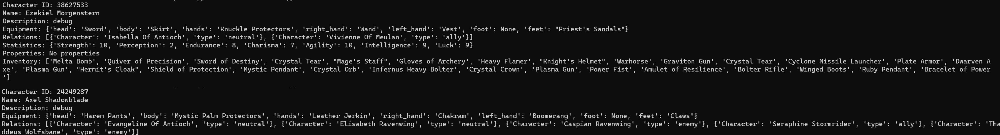

# Wonderloom

## Created By:

1. Jack Cooper - Code, System Design, Documentation, Maintainence, and Overall Development   2. Ethan Pike - Design, Testing, and Analysis 

## Project Description: Wonderloom

### Seamless Weaving:
Wonderloom is envisioned as a companion tool that helps inspire imagination and spark creativity. A core concern of world building is contextual continuity while playing with friends or an AI Language Model (such as ChatGPT), and this concept stays central in development efforts. Through contemporary frameworks and tools, the project aims to tackle the issue of world tracking in text-based game management and play. One can only go so far with world building and interacting before details become muddied and concret tracking falls by the wayside. Or worse, the imagined story teller never bothered to remember your inventory's contents. A core component of Wonderloom's goal is to serve as this tool; to help facilitate world data capture with ease. By utilizing such means as an ORM database backed with PostgreSQL and powered through Python, organizing and utilizing data will no longer be an arduous chore. Players, world-builders, dreamers, and dataphiles alike may take advantage of the tool to focus on the aspects they enjoy most.

### Untangled Fabrics:
Maintaining consistent statistics and world data is crucial for an immersive gameplay experience. A goal for Wonderloom is to not only allow for players and storytellers to delve deeper and draw upon a efficient and effective means for tracking contextual world-building aspects, but to be more bolder in doing so! A philosophy of design with Wonderloom is letting users dictate what should or should not be tracked. Part of the allure of immersing yourself in a world is the unknown. Perhaps, not knowing what the AI story teller has planned is sometimes desirable. Maybe, only tracking aspects that relate directly to the player character or player civlization is necessary. Mystery allows for surprise and suspense.

### Narrative Tapestry:
Crafting compelling story arcs is a cornerstone of text-based play and homebrewed gaming, and Wonderloom aims to revolutionize long-term story arc management. By leveraging modern technologies and design principles, the capture and retrieval of any critical plot points, player choices, and significant events shall never be more than a query away. This data will serve to help users track their worlds and characters, weaving a narrative tapestry that may withstand multiple gameplay sessions without unraveling. In doing so, players may help preserve context themselves to then use to restore or update contexual states through text-based summaries of data to provide to their imaginative game master to utilize. Whether the model is trained to inquire the user about a character's stats, or information necessary for it to consider the outcome of a battle, this tool seeks to help make this as easy as possible.

We embark on this exciting journey as we hope to knit possibilities and stitch worlds - a thread at a time.

## Dynamic Content Generation and Context Preservation Challenges in Text Games:

One of the most fascinating aspects of AI language models, such as ChatGPT, is their ability to generate dynamic content and create immersive storytelling experiences in text-based games. However, preserving context and maintaining a coherent narrative pose significant challenges. In our project, we address these challenges by leveraging the power of Python, PostgreSQL, and modern frameworks. We start by addressing the points brought up earlier:

-  Contextual Continuity:
To ensure a seamless gameplay experience, our project focuses on context preservation. We understand the importance of enabling AI agents to remember crucial details from previous interactions. By implementing robust database management techniques with PostgreSQL, we can store and retrieve relevant information, allowing the AI agent to maintain consistent context throughout the game. This ensures that responses align with prior player choices and interactions, enhancing the believability and immersion of the gameplay.

- Logical Coherence:
Logical coherence is vital in creating a cohesive narrative. We recognize the need for AI agents to generate responses that make sense within the context of the game's storyline. By employing consistent data to the model, we can guide the AI agent's generation process. The ability to provide concrete aspects about the world helps the AI agent stay on track and deliver logical, contextually appropriate responses to player actions.

- Long-Term Story Arc Management:
Text-based games often feature intricate storylines that evolve over multiple sessions or interactions. Our project tackles the challenge of managing long-term story arcs by leveraging PostgreSQL's capabilities as a reliable and scalable database solution. We can capture and store critical plot points, player choices, and significant events, enabling the AI agent to reference and build upon this historical data. By keeping a comprehensive record of the game's progression, we facilitate the generation of coherent narratives across multiple gameplay sessions, ensuring a consistent and immersive story experience.

## Key Features:

1. Custom Data Capture (In Development): The project enables the capture of game-specific data, allowing developers to define and store custom information in a database. This flexibility ensures that the captured data aligns with the unique requirements of each game.

2. Text-Based Engine and Database Interface (Planned): The project serves as the foundation for a text-based game engine that empowers developers to track game progress and manage game-related data. It seamlessly interfaces with a PostgreSQL database, enabling efficient and reliable storage, retrieval, and querying of game-related information.

3. User-Hosted Servers with Multiuser Support (In Development): This project also incorporates the ability for users to host their own servers, facilitating simultaneous interactions between multiple users and the program's database. Users can enjoy a collaborative environment where they can interact and share data seamlessly. This feature enhances the overall experience by fostering dynamic interactions and promoting efficient data sharing among users.

4. AI Language Model Integration (Planned): By integrating with AI Language Models like ChatGPT, the project facilitates the seamless interaction between games and advanced natural language processing capabilities. This integration opens up possibilities for enhanced game experiences, intelligent conversations, and dynamic storytelling.

5. Modular Design (In Development): The project follows a modular architecture, enabling developers to easily modify and extend its functionality. This flexibility ensures that the system can adapt to various game limitations, requirements, and preferences. Developers can selectively integrate specific modules or build upon the existing ones to create a tailored solution.

By combining the ability to capture custom game data, interact with AI Language Models, and offer modularity for flexibility, Wonderloom hopes to provide a powerful toolset for users to create immersive and dynamic game experiences all while effectively tracking and managing game-related data with the support of modern technologies.

#### Current State:

The project has some foundational aspects established. To date, a basic implementation of some rudimentary features is finished, albeit, no module or feature is really fully implemented. As a solo developer, working full-time hinders the possiblity of rapid development, but, with a clear goal set and passion for forging this tool into a reality, the motivation remains hopefully determined. 

##### Current Build Progress:
1. The main.py file currently implements basic CRUD operations to update the database effectively.
2. The database.py module provides additional support features for controlling, monitoring, and persisting the database.
3. Various independent utility files, such as db/randomCharacter.py, have either completed or nearly completed functionalities. These files play a crucial role in automating testing and development processes, and they have received significant focus during the project's development phase.
4. Although there are a few outstanding issues and the need to finalize the schema design, the combination of randomCharacter.py and random.json allows for automated character generation to a reasonable extent, primarily targeted towards text/tabletop RPG games. While this functionality may not directly align with the project's main goal, it greatly aids in testing procedures as we progress towards finalizing the schema.
5. Prioritizing the backend development stage ensures a strong foundation for the project before diving into frontend aspects such as interface design and user control. This approach ensures that frontend development will have a solid framework to build upon.
6. The main design for the schema is heavily under design currently and is subject to change. 
